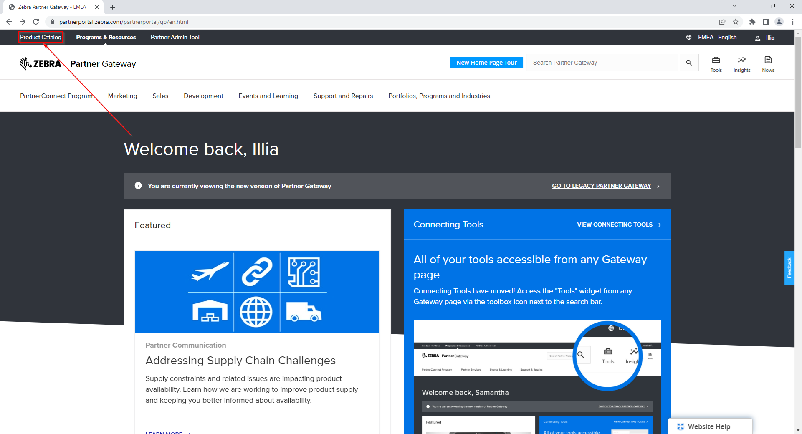
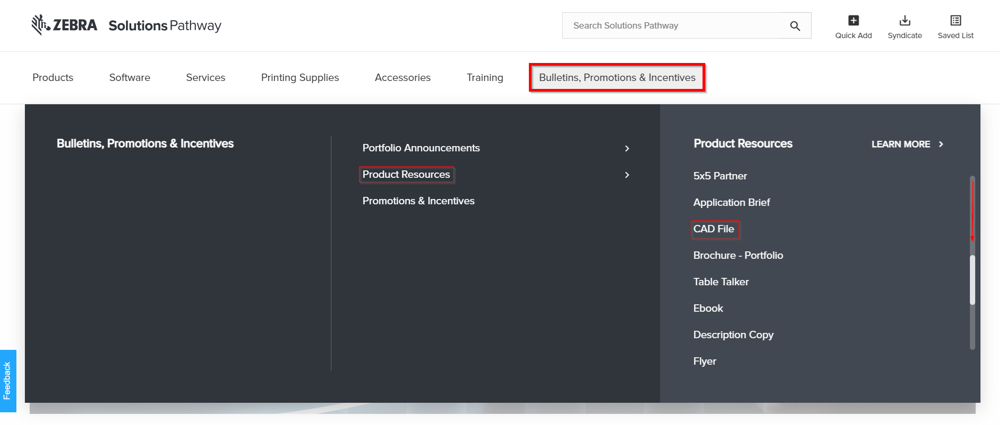

## プリンタの寸法図（CADデータ）を取得する方法

ラインへの組み込み設計などでゼブララベルプリンタのCADデータが必要になることがあります。CADデータは Zebra Solutoin Pathway* からダウンロードができます。

\* アクセス権が必要です。アクセス権をお持ちで無い方はゼブラ社の担当営業にお声がけください。

1.  [Partner Gateway](https://partnerportal.zebra.com/partnerportal/ap/en.html) へログイン。
2.  [Product Catalog]を選択。　
    

3. [Bulletins, Promotions & Incentives] を選択。

    

4. [Product Resources]を選択。
5. [CAD File]を選択し、対象プリンタのCADデータをダウンロードする。
